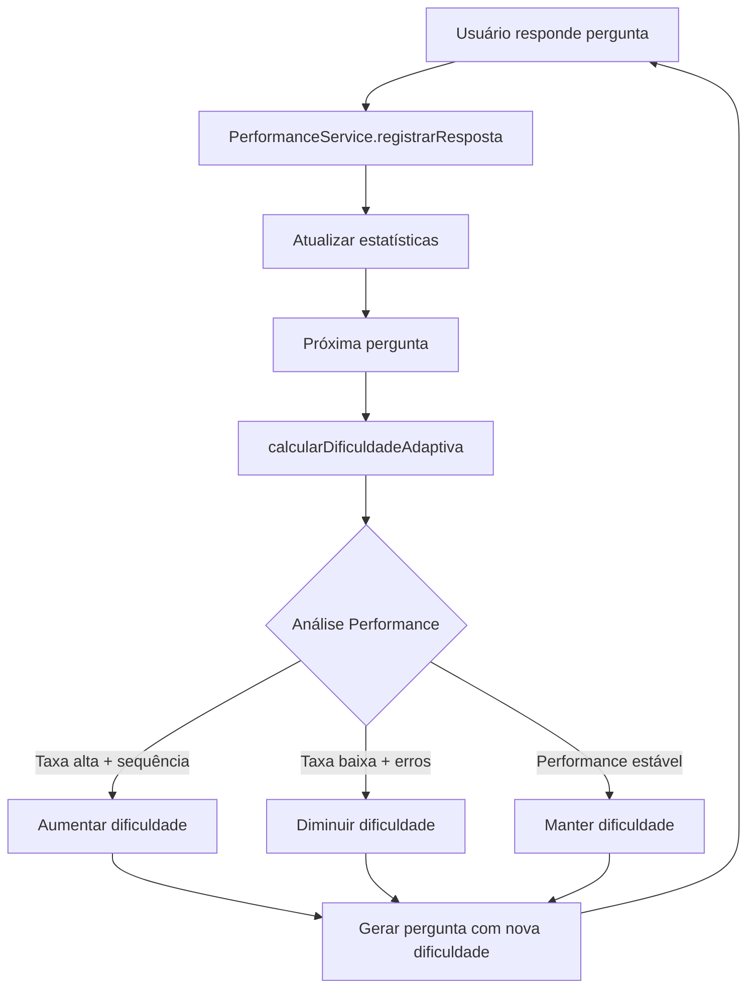

# Sistema de Dificuldade Adaptiva - MathQuest

## Visão Geral

O MathQuest agora possui um sistema inteligente de **Dificuldade Adaptiva** que ajusta automaticamente o nível das perguntas baseado na performance do usuário. Este sistema visa otimizar o aprendizado, mantendo o usuário sempre desafiado de forma apropriada.

## Como Funciona

### 1. **Coleta de Performance**

- Cada resposta do usuário é registrada no `PerformanceService`
- Sistema rastreia:
  - Taxa de acerto geral
  - Taxa de acerto das últimas 10 respostas
  - Sequências de acertos/erros consecutivos
  - Performance por tipo de questão
  - Histórico detalhado das últimas 100 respostas

### 2. **Algoritmo de Ajuste**

#### **Aumentar Dificuldade:**

- Taxa de acerto recente ≥ 80% + 3+ acertos consecutivos
- Performance consistentemente alta

#### **Diminuir Dificuldade:**

- Taxa de acerto recente ≤ 40% + 2+ erros consecutivos
- Dificuldade em manter performance adequada

#### **Ajustes Sutis:**

- Taxa de acerto entre 50-70%: ajustes graduais baseados em sequências
- Sistema evita mudanças bruscas para manter experiência fluida

### 3. **Níveis de Dificuldade**

#### **Fácil** 🟢

- Conceitos básicos e fundamentais
- Cálculos simples e diretos
- Aplicações imediatas e óbvias
- Adequado para revisão ou introdução

#### **Médio** 🟡

- Aplicação prática dos conceitos
- Problemas com 1-2 passos de raciocínio
- Interpretação de situações do dia a dia
- Combinação de conceitos básicos

#### **Difícil** 🔴

- Raciocínio avançado e análise crítica
- Problemas complexos com múltiplos passos
- Aplicações não óbvias e desafiadoras
- Integração de múltiplos conceitos

## Recursos Visuais

### Interface do Quiz

- **Badge de Dificuldade**: Mostra o nível atual com cor e ícone apropriados
- **Indicador no Cabeçalho**: Dificuldade visível no subtitle do quiz
- **Feedback Visual**: Cores representam o nível (verde/amarelo/vermelho)

### Tela de Resultados

- **Card de Performance**: Estatísticas detalhadas da performance
- **Taxa de Acerto Geral**: Desempenho histórico do usuário
- **Performance Recente**: Baseada nas últimas 10 respostas
- **Sequências**: Mostra streaks de acertos ou erros
- **Dificuldade Atual**: Estado adaptativo atual

## Implementação Técnica

### Arquivos Principais

1. **`performance_service.dart`**

   - Gerencia coleta e análise de dados
   - Algoritmo de ajuste de dificuldade
   - Persistência com SharedPreferences

2. **`quiz_alternado_screen.dart`**

   - Integração com sistema adaptivo
   - Interface visual do sistema
   - Registro automático de respostas

3. **`quiz_helper_service.dart`**
   - Prompts aprimorados com descrições detalhadas
   - Geração contextualizada por dificuldade

### Dados Persistidos

```dart
// Estatísticas Gerais
'total_perguntas': int
'total_acertos': int
'total_erros': int
'taxa_acerto_geral': double

// Estado Atual
'sequencia_acertos': int
'sequencia_erros': int
'dificuldade_atual': String

// Histórico Detalhado
'ultimas_respostas': List<String>  // Últimas 10
'historico_performance': List<String>  // Últimas 100
```

## Benefícios Pedagógicos

### **Personalização**

- Cada usuário tem experiência única baseada em sua habilidade
- Evita frustração (muito difícil) ou tédio (muito fácil)

### **Motivação**

- Progressão visível através do aumento de dificuldade
- Feedback imediato sobre performance

### **Aprendizado Otimizado**

- Zona de desenvolvimento proximal adaptativa
- Desafios apropriados para máximo aprendizado

### **Retenção**

- Usuários permanecem engajados com dificuldade adequada
- Sistema "aprende" o perfil do usuário

## Uso do Sistema

### Para Usuários

1. **Início**: Novo usuário começa com dificuldade "Fácil"
2. **Progressão**: Sistema ajusta automaticamente conforme performance
3. **Feedback**: Visualiza estatísticas na tela de resultados
4. **Segurança**: Estatísticas não podem ser resetadas pelos alunos (apenas por administradores)

### Para Desenvolvedores

```dart
// Registrar resposta
await PerformanceService.registrarResposta(
  acertou: true,
  dificuldade: 'médio',
  tipoQuiz: 'multipla_escolha',
);

// Obter dificuldade adaptiva
String dificuldade = await PerformanceService.calcularDificuldadeAdaptiva();

// Obter estatísticas
Map<String, dynamic> stats = await PerformanceService.obterEstatisticas();
```

## Futuras Melhorias

### **Machine Learning**

- Modelo preditivo mais sofisticado
- Análise de padrões de erro específicos

### **Personalização Avançada**

- Ajuste por tipo de questão individual
- Perfis de aprendizado (visual, lógico, etc.)

### **Analytics**

- Relatórios detalhados para educadores
- Identificação de áreas de dificuldade

### **Gamificação**

- Conquistas baseadas em melhoria de performance
- Sistema de níveis e experiência

---

## Exemplo de Fluxo



Este sistema torna o MathQuest verdadeiramente adaptativo, proporcionando uma experiência de aprendizado personalizada e otimizada para cada usuário.
